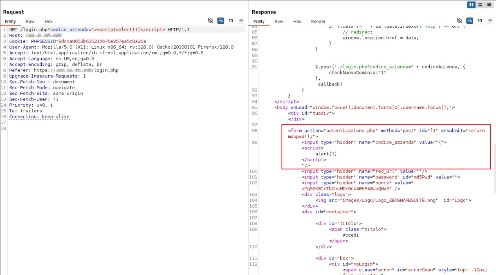
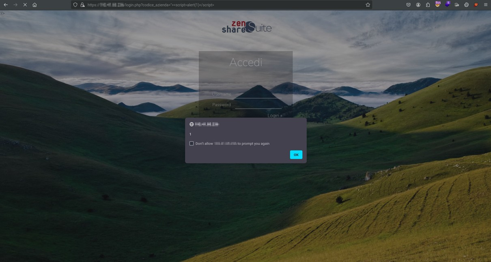
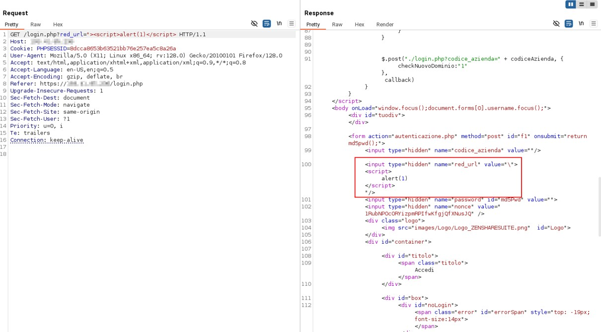

# CVE-2026-30252 - Multiple Reflected Cross-Site Scripting (XSS) in ZenShare Suite

## Details
* **CVE ID**: CVE-2026-30252
* **Vulnerability Type**: Cross Site Scripting (XSS)
* **Vendor**: Interzen Consulting S.r.l
* **Product**: ZenShare Suite
* **Affected Version**: < 17.0
* **Affected Component**: `login.php`
* **Vulnerable Parameters**: `codice_azienda` (GET), `red_url` (GET)

---

## Description
Multiple reflected cross-site scripting (XSS) vulnerabilities in the **login.php** endpoint of Interzen Consulting S.r.l ZenShare Suite v17.0 allows attackers to execute arbitrary Javascript in the context of the user's browser via a crafted URL injected into the **codice_azienda** and **red_url** parameters.

## Impact
Successful exploitation of these vulnerabilities allows an attacker to execute arbitrary JavaScript code in the victim's browser. This can lead to:
* Session hijacking (theft of session cookies)
* Redirection of users to malicious websites
* Unauthorized actions performed on behalf of the authenticated user

---

## Proof of Concept (PoC)
##  ```GET /login.php?[codice_azienda, red_url]```

Malicious Payload:

```
codice_azienda="><script>alert(1)</script>
```





Malicious Payload:

```
red_url="><script>alert(1)</script>
```




# References
https://nvd.nist.gov/vuln/detail/CVE-2026-30252 <br>
https://cve.mitre.org/cgi-bin/cvename.cgi?name=2026-30252 <br>
# Credits
**Manuel Scala**, **Federico Mirra** <br></br>
<a href="https://sk-it.com/">
